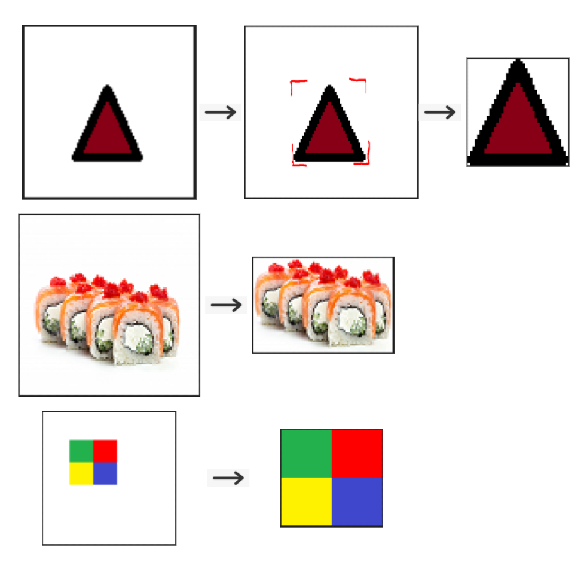

# Ingredients Decoder - Hardware Acceleration - CPEN 391

### Repo contents:

- bmps: BMP formatted pictures
- boundingBox: module that detects the bounding box of an item on a white background
- boundingBox_avalon: boundingBox module that conforms to avalon interface
- boundingBox_v2: boundingBox module but does not use a RAM and background under bad lighting
- c: code to convert BMP images into HEX files in C
- cropping: module that crops and generates BMP output images
- MATLAB: HEX files generated from BMP images

### Description:

Hardware acceleration module in Verilog that can read a HEX file of an image and crop out the white background of that image.

The Verilog module, called ‘boundingBox.v’, can detect the bounding box of an item on a white background.

That bounding box is then used to crop out the unnecessary white pixels and create a cropped image of type BMP. 2 Verilog modules are used to perform this cropping and image generating:

- header.v: used to instantiate the header for this BMP file.
- cropping.v: used to instantiate the pixel array for the BMP file.

We have a top module that uses all these 3 modules to perform cropping as shown below.

